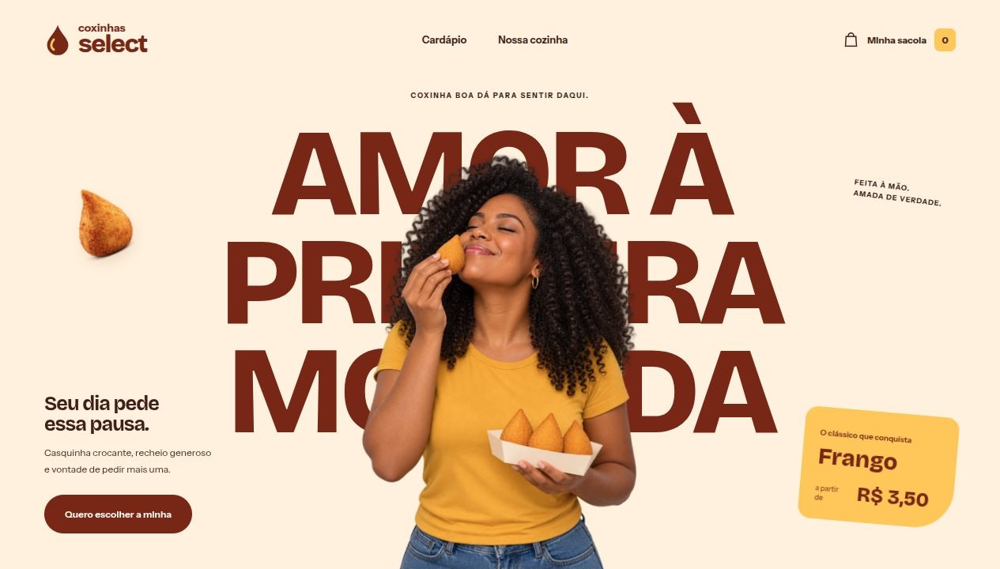

# Coxinhas Select

E-commerce de coxinhas artesanais desenvolvido por **Giselly Pereira**. Uma vitrine com identidade própria, cardápio interativo e uma sacola que acompanha cada escolha.



[Ver a página completa](docs/preview-campaign-v2-desktop.png) · [Ver a versão para celular](docs/preview-campaign-v2-mobile.png)

## A experiência

A interface aproxima a loja de uma campanha de gastronomia: uma pessoa saboreando uma coxinha ocupa o centro da hero, sobre um título em camadas. O cardápio combina formatos diferentes para destacar os sabores, e uma fotografia de perto apresenta a textura e o recheio.

A identidade usa creme, vinho e amarelo, uma marca vetorial própria e as fontes **Bricolage Grotesque** e **Instrument Sans**, carregadas localmente.

## Funcionalidades

- Cardápio com quatro sabores de coxinha e duas bebidas.
- Filtros para coxinhas, bebidas ou todos os produtos.
- Adição e remoção de unidades, com quantidades e total atualizados na interface.
- Sacola persistida no navegador com `localStorage`.
- Página de revisão do pedido e confirmação demonstrativa.
- Layout responsivo, controles com rótulos acessíveis e respeito à preferência por movimento reduzido.

> A finalização simula um pedido. O projeto não processa pagamentos nem envia pedidos para entrega.

## Tecnologias

| Tecnologia | Uso |
| --- | --- |
| React 18 | Componentes e estado da sacola |
| JavaScript | Filtros, quantidades e cálculo de preços |
| React Router | Navegação entre cardápio, sacola e confirmação |
| Vite | Desenvolvimento local e build de produção |
| CSS | Composição, responsividade e animações |
| WebP e SVG | Fotografias otimizadas, marca e ilustrações |

## Executar localmente

Com Node.js e npm instalados:

```bash
git clone https://github.com/GisellyPereira/E-commerce.git
cd E-commerce
npm install
npm run dev
```

Abra o endereço local exibido pelo Vite no terminal. `npm start` também inicia o servidor de desenvolvimento.

Para gerar e conferir a versão de produção:

```bash
npm run build
npm run preview
```

Os arquivos de produção são gerados em `dist/`.

## Navegação

| Rota | Página |
| --- | --- |
| `/` | Vitrine e cardápio |
| `/carrinho` | Itens escolhidos e resumo do pedido |
| `/finalizar` | Confirmação da simulação |

Em uma hospedagem estática, configure o fallback das rotas para `index.html`. O arquivo [`public/_redirects`](public/_redirects) inclui o fallback para Netlify. O [`netlify.toml`](netlify.toml) configura o comando de build `npm run build`, o diretório de publicação `dist` e o Node.js 22.

## Organização

```text
src/
  App.jsx          Interface, rotas e estado da sacola
  App.css          Identidade visual e estilos responsivos
  main.jsx         Entrada da aplicação
  components/common/Menu/data.js   Catálogo de produtos
public/
  images/          Imagens e ilustrações
  fonts/           Fontes locais e licenças
  _redirects       Fallback de rotas
docs/              Capturas da interface e prompts das imagens
```

Os sabores e preços do projeto original foram mantidos. O estado da sacola também reconhece as quantidades armazenadas pela versão anterior.

## Imagens e créditos

As capturas deste README mostram a interface implementada. As imagens de campanha e de alimentos foram geradas com **imagegen** e têm uso ilustrativo. A pessoa da hero é uma modelo fictícia de campanha; não representa uma cliente ou integrante de uma equipe real.

Os prompts e os caminhos dos arquivos estão documentados em [`docs/campaign-v2-prompts.txt`](docs/campaign-v2-prompts.txt) e [`docs/image-prompts.txt`](docs/image-prompts.txt). A marca e as latas foram desenhadas em SVG. As licenças OFL das fontes estão em [`public/fonts`](public/fonts).

## Autora

**Giselly Pereira** — desenvolvimento front-end, web e mobile.

[Conheça meus projetos no GitHub](https://github.com/GisellyPereira)
